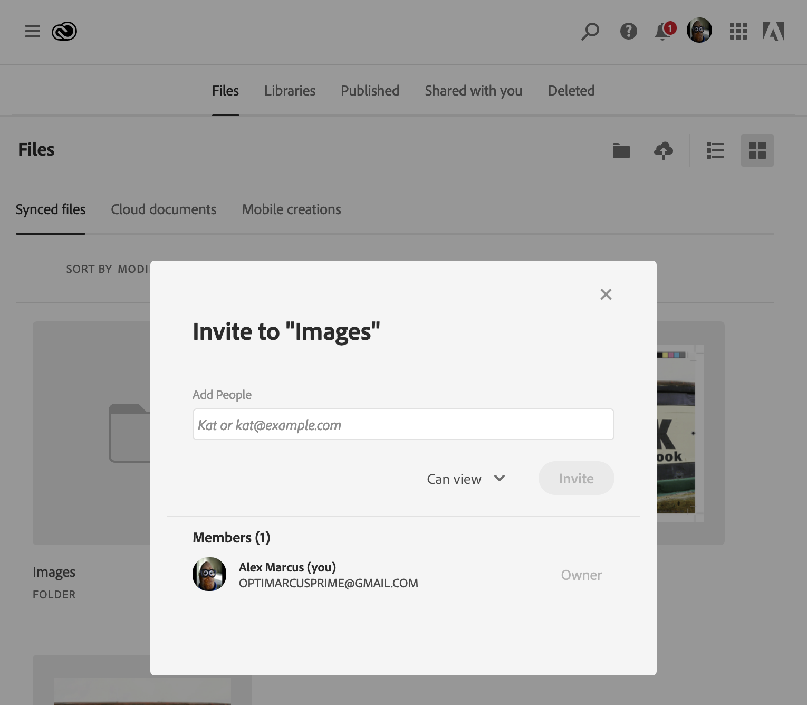
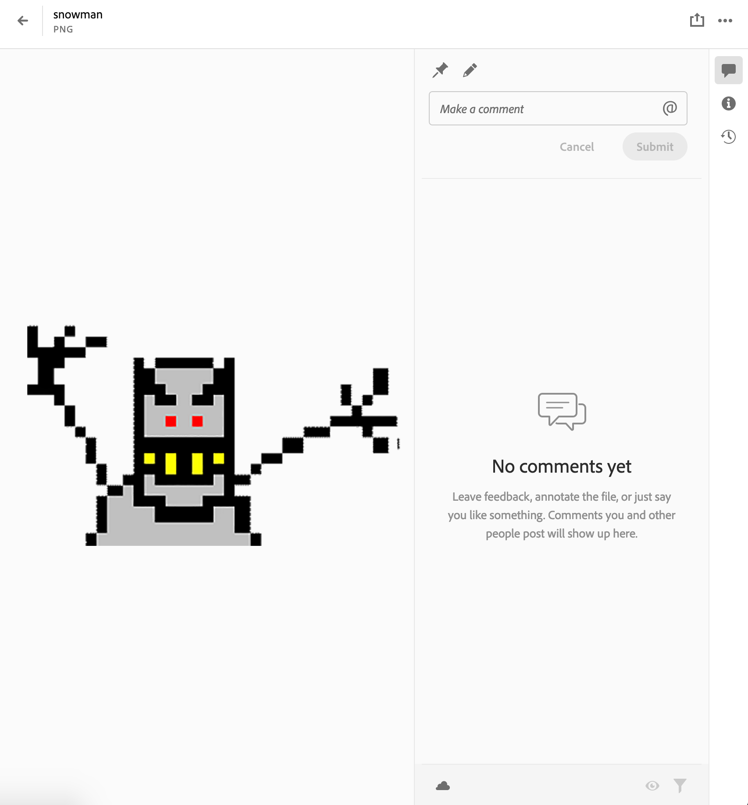

Within the Adobe Creative Cloud Experience group, I made components which enable collaboration between creatives and the people they create for. We used a large number of cloud infrastructure solutions, as well as web and native technologies.

### Sharing Component
The sharing component enables users to find and connect with collaborators.  It establishes document-level permissions and sends notifications to collaborators.  It has address book features which make finding collaborators easy.  It also has a large variety of configuration options, allowing it to service many Adobe product needs.

### Commenting Component
The commenting component allows collaborators to discuss assets directly.  This intuitive interface supports pinning, drawing, and other annotations along with text comments.  Collaborators can be @ mentioned to notify them of discussions.  This component is also highly customizable to support many Adobe product needs.

