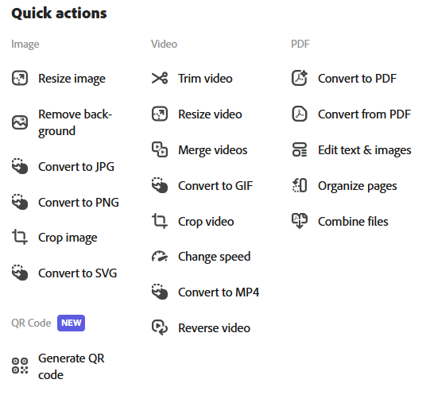

In 2021 I moved to Adobe Express software engineering after working in the Adobe Cloud Collaboration team for several years.  I was very excited to contribute to Adobe creative software.  Express is a web-first product, which allowed me to directly improve the capabilities of creative professionals.

My primary responsibility within Express was maintaining and developing the quick actions.  Quick actions are pieces of single-function Adobe technology, exposed via Express for fast task completion.

Using modern web technologies like web components with Lit, template elements, micro-frontend architecture, and progressive web apps, I helped create a number of new quick actions.  I also monitored user feedback and bug reports, providing precise fixes and planning for features releases.