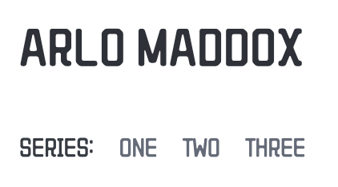
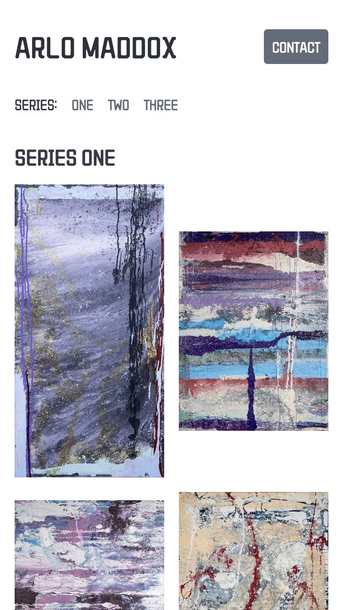

[Arlo Maddox](https://arlomaddox.com/) is a painter based in the Pacific Northwest whose work spans a range of styles and subjects. When Arlo approached me about building a website, he needed more than a generic portfolio template—he wanted a space that reflected his artistic identity and gave his collection the presentation it deserved.

The result is a fully custom gallery site built to his specification.

### Working with the client

Working directly with Arlo, I translated his aesthetic sensibilities into design decisions—choosing colors, typography, and layouts that felt like extensions of his creative voice rather than afterthoughts. Every visual detail was intentional and grounded in his feedback, from the palette down to the spacing between works.

This kind of close collaboration with an individual artist means the client's trust is central to the process. Arlo had a clear vision, and my job was to realize it faithfully while bringing technical expertise to the decisions he hadn't yet considered.

### Custom design

The site was built from the ground up with no off-the-shelf theme. Colors, fonts, and layout structures were all chosen in close coordination with Arlo to reflect the tone and mood of his work. The goal was a site that felt like it belonged to him specifically—not a generic art portfolio.

### Collection digitization and organization

Beyond the build itself, I helped Arlo organize and digitize his collection for display on the web. This involved working through his body of work to establish a coherent structure—grouping pieces into series, standardizing image presentation, and ensuring each work was represented accurately and attractively online.

### Responsive layout

The gallery adapts cleanly across screen sizes, so whether visitors are browsing on a phone or a large desktop monitor, the artwork is presented with care. Image grids and navigation reflow gracefully at every viewport, keeping the focus on the paintings themselves.

