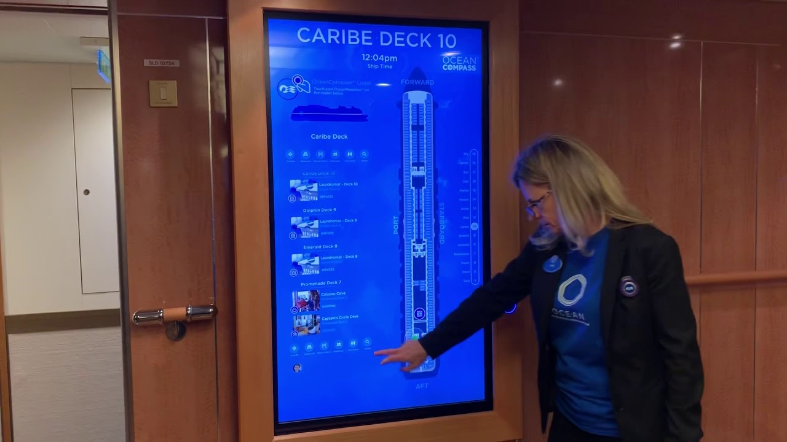

During my time as a Senior Developer and Team Lead at Level 11, I played an integral role in the ideation, build, delivery, and support of a Wayfinding system for Carnival Cruise Lines. This system is a key part of the [OCEAN](https://www.ocean.com/ocean/) user experience aboard Carnival's Medallion-Class ships, and is known to guests as Ocean NAV.

During the conceptualization of Wayfinding, I ran a formal research study of map comprehension by working with a dedicated design team to develop functional mocks, feature trials, and UX test suites. To identify optimal solutions for the proposed designs I conducted technical explorations to discover available technologies.

In preparation for [CES 2017](https://www.wired.com/2017/01/carnival-ocean-medallion-wearable/), I developed the proof-of-concept Wayfinding Beta in web technologies such as WebGL, Node.js, and React. This demonstration was presented to members of the press and the project was mentioned in [Arnold Donald's keynote address](https://www.youtube.com/watch?v=Im7xJeHrvkM).

As the timeline moved from demonstration to production, the tech stack changed to Unity3D. At the same time, I was asked to take on the Team Lead role for Wayfinding and entrusted with its delivery.

In this new leadership position, I guided a team of 6 developers to implement, test, and deploy Wayfinding. In November 2017 the Ocean NAV project was successfully delivered to Carnival's first Medallion-Class ship. Its ability to guide guests through labyrinth-like ships and provide insight into activities has been a highlight of the OCEAN experience.