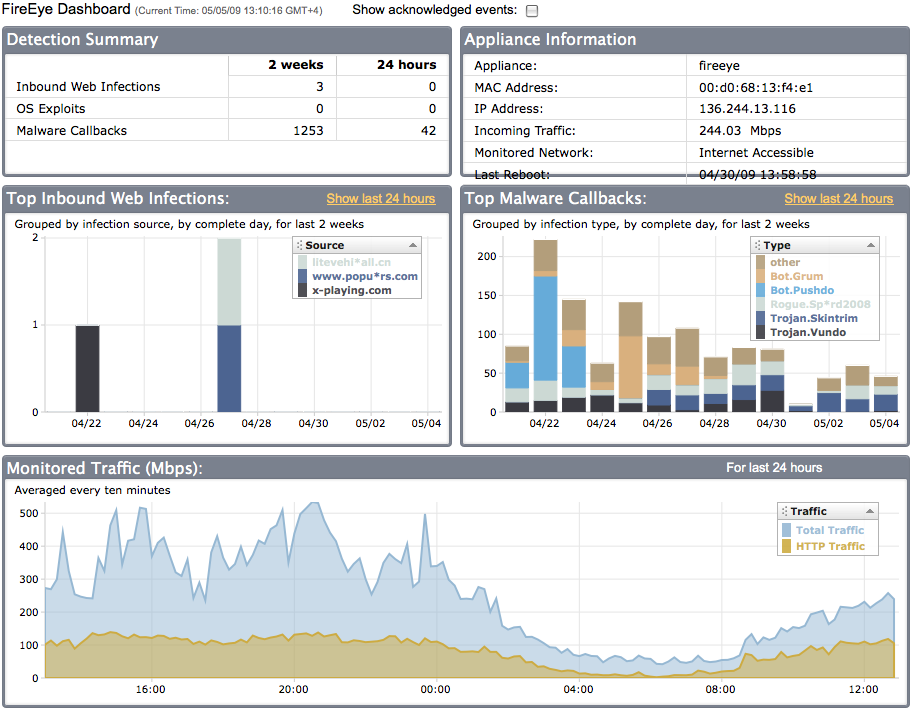

[FireEye](https://www.fireeye.com/) is a US network security company that specializes in advanced protection against a variety of cyber threats.  Their main software line consists of the Malware Protection System for web security, email security, file security, and malware analysis.

During a research seminar at Connecticut College, I turned to the world of network security with special attention paid to how malware infects networks.  With the help of a mentor from FireEye, I was able to install, administrate, and utilize their malware detection software on the Connecticut College campus network.

With this tool at my disposal, I viewed and collected data on the number of cyber threats in the college's network ecosystem at any given time.  Using that information I was able to provide the Information Technology department with recommendations of anti-malware options for students, campus computer patches, and opportunities for increased firewall effectiveness.  I presented my findings to the Computer Science department in a public seminar on network security.

