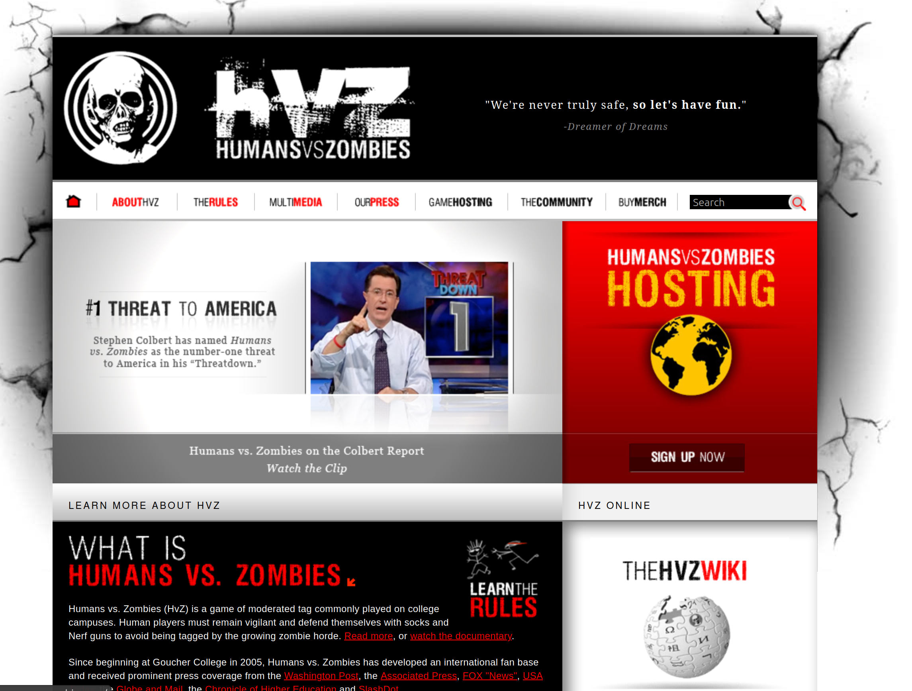

Humans vs. Zombies (HvZ) is a game of moderated tag played at schools, camps, neighborhoods, military bases, and conventions across the world. Human players must remain vigilant and defend themselves with socks and dart blasters to avoid being tagged by a growing zombie horde.

I was responsible for the continuation and administration of Humans Vs. Zombies games at Connecticut College, and I also contributed to the game's core codebase as an outside developer. When the HvZ site still ran on a backbone of PHP, I developed a Twitter API integration to allow constant game updates to be triggered by in-game events and delivered to the micro-blogging service. 

Additionally, I updated HvZ's administrative backend to allow more efficient rule alteration and player generation.
Through my participation and contributions I made great connections in the HvZ community, both within my school and outside of it.

