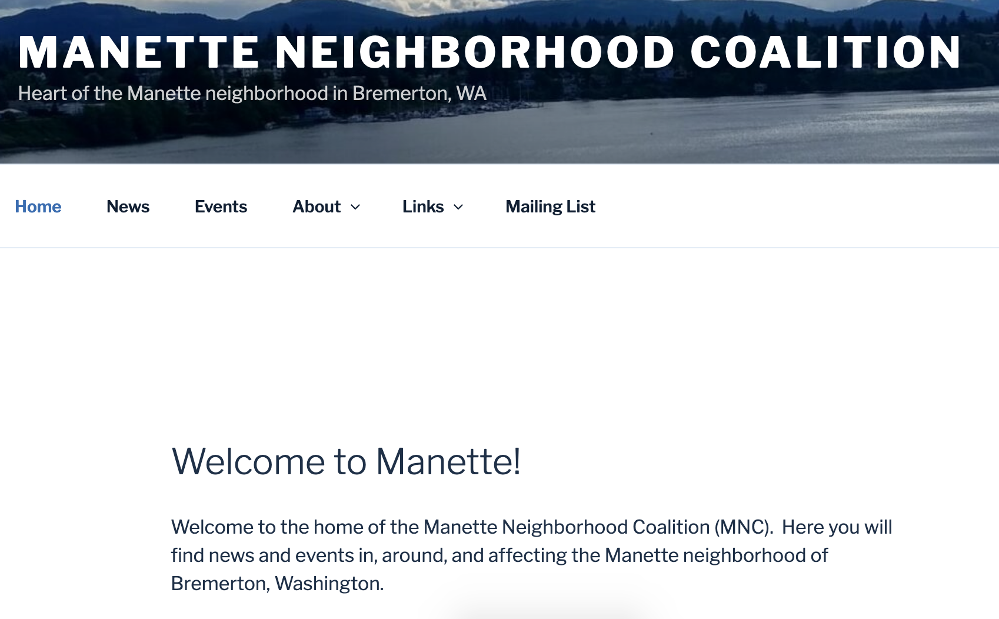

I volunteered for the Manette Neighborhood Coalition as the Technology Officer.  My first task was to revamp their out-of-date website. Working alongside my fellow board members, I created a brand identity and developed a Wordpress site.

The Wordpress site, hosted at manette.org, provides a central location for community events and news. It includes calendar functionality which enables event planning and notifications of neighbors via email. We also used Wordpress's default posting functionality to handle news and updates.

The logo reflected the Manette community, which has a proud identity stemming from the separation between Manette and downtown Bremerton. This separation exists because of the Manette Bridge, and so that pride is reflected in the bridge's feature in the logo.

