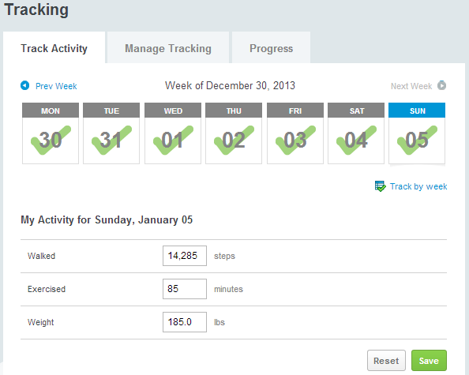

ShapeUp was my first professional tech job outside of my college environment, and it launched me into a career of software engineering across a full stack of technologies. Their activity-tracking social platform utilized user participation and organization-level events to encourage healthy employee lifestyles.

During my time at ShapeUp I was tasked with a number of different projects. Each contributed a user-facing component, and I was responsible for contributing to the entire product from inception, to definition, to design, to development and delivery.

## Don't Forget List
To make participation easier, I helped code an MVC widget of PHP/MySQL-driven checkbox reminders.  The Don't Forget list's intuitive UI and modern HTML/CSS made it a vital tool in ShapeUp's platform.

## Live Supporter Search
I was the lead developer for a re-code of the supporter search page, implementing live search results and one-click "Add as Supporter" links.  These results were displayed actively as the user entered a query. Results could be further refined by interest and location.

## Participant Support Form
ShapeUp asked me to create a participant support form for gathering information about issues regarding their social health platform.  To streamline triaging over 2,700 technical platform incident tickets per year, I worked closely with the Participant Support department to identify key information required when tickets are filed.

The result was a straightforward contact form which pulled user information to automatically fill initial fields. With browser/OS detection and integration with the Participant Support ticket system, this form provided a more efficient contact path for over 600,000 users around the world.

## People You May Know
The People You May Know widget generated potential supporter suggestions based on user activities and interest compatibility. This widget worked within ShapeUp’s scoped organization and privacy settings.

I was the lead developer for this widget, and worked closely with analysts to establish an optimal algorithm for supporter compatibility.  I then coded the query in MySQL and used PHP to display the results.

## Fitness Tracking Calendar
This tracking calendar was the core of the ShapeUp platform, allowing users to track their fitness-related metrics on a daily or weekly basis.  Metrics were either standard, for competitions and charts, or customized to track the participant's personal goals.

I developed a number of improvements and fixes for this component, either initiated by the product management team or in response to technical issues.  Much of the calendar's functionality involved synchronizing database changes with UI updates.  Active widgets on the page were updated on-the-fly with averages, ranks, and more.

