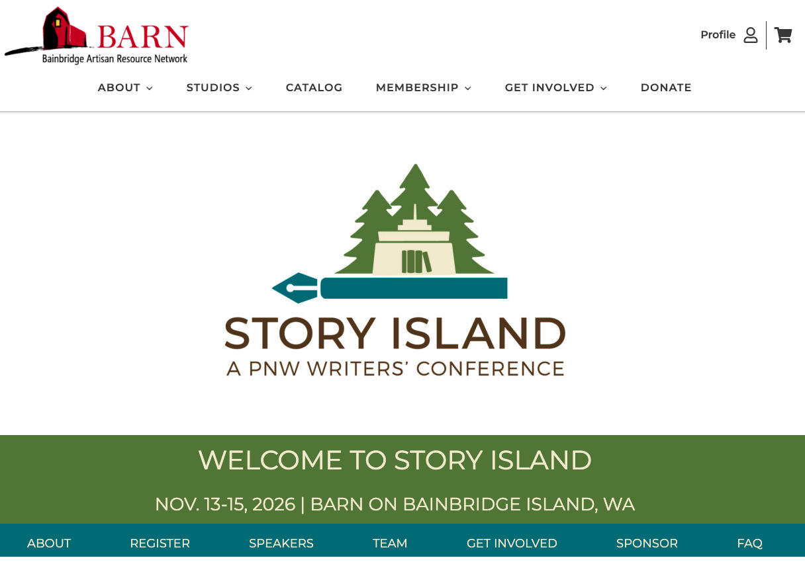
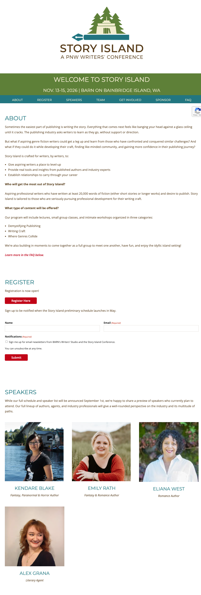
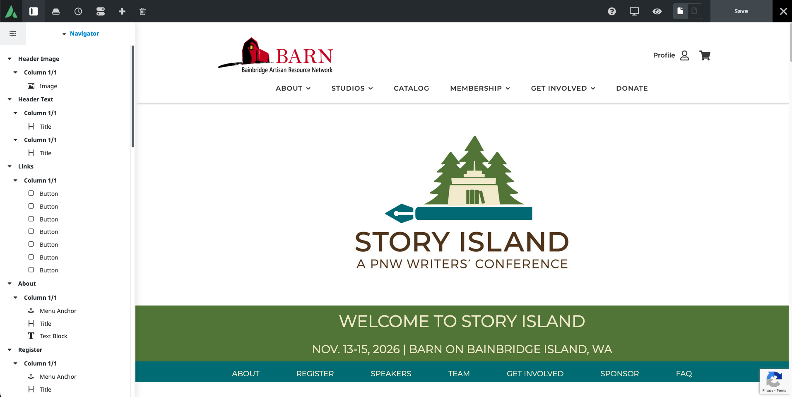
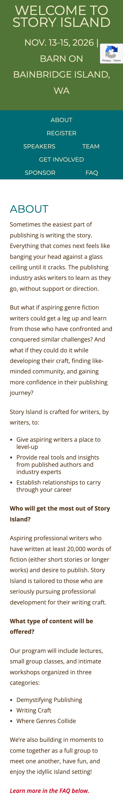
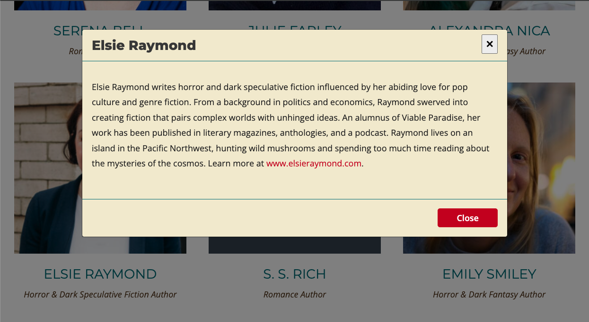

[Story Island](https://bainbridgebarn.org/storyisland/) is a genre fiction writing conference organized by the [Bainbridge Artisan Resource Network (BARN)](https://bainbridgebarn.org/), a non-profit artisan community on Bainbridge Island, WA. The event brings together aspiring writers, published authors, and industry professionals for a weekend of craft development, publishing insights, and community building.

The Story Island team came to me to build a landing page that would serve as the public face of the conference—capturing registrations, showcasing speakers, and answering frequently asked questions, all while fitting cleanly within BARN's existing web presence.

### Working with clients

Collaborating closely with the Story Island organizers and their design team, I translated their creative vision into a fully functional web page. The team had strong ideas about tone and visual identity, and my role was to bridge that direction with a technical implementation that was polished and easy for a non-technical team to maintain going forward.

Regular communication with stakeholders kept the design on track—from initial layout discussions through rounds of content review and iteration before launch. Working with a non-profit also meant being mindful of their constraints, keeping the solution practical without sacrificing quality.

### WordPress implementation

Because Story Island lives within BARN's existing WordPress infrastructure, I built it as a custom page within their established theme and plugin ecosystem. This gave the Story Island team the ability to update speaker bios, registration links, and FAQ content on their own, without needing a developer for routine edits—an important factor for a volunteer-run organization.

### Responsive design

The page was built with a fully responsive layout, adapting cleanly across desktop, tablet, and mobile viewports. Speaker grids, section content, and calls to action reflow gracefully at every screen size, ensuring writers can access the information they need from any device.

### Modal image viewer

Speaker and team headshots are displayed in a modal image viewer, allowing visitors to view larger versions of each photo without leaving the page. The interaction keeps the browsing experience smooth and contextual—particularly useful given the number of speakers and team members featured on the page.

### Domain and DNS configuration

In addition to the site itself, I registered and configured the custom domain [storyislandpnw.com](https://storyislandpnw.com/), setting up DNS records to point to BARN's hosting infrastructure. This gave Story Island a standalone, memorable web address to use for marketing and promotion independent of the BARN subdirectory URL.