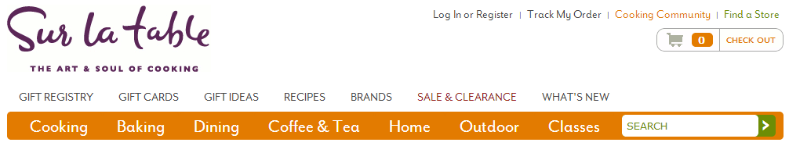
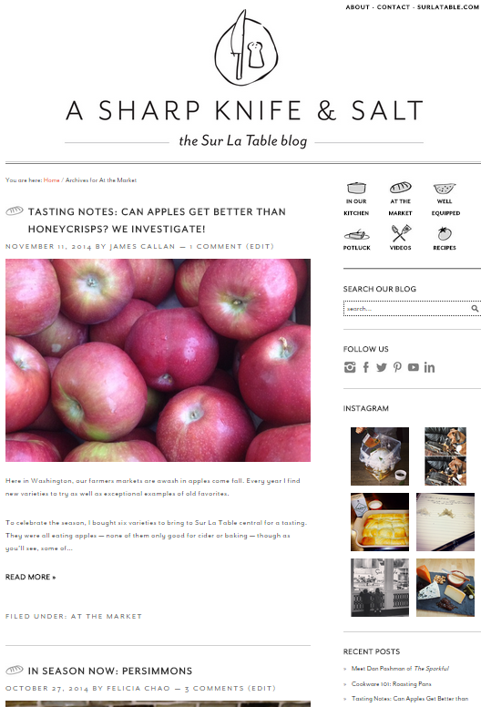
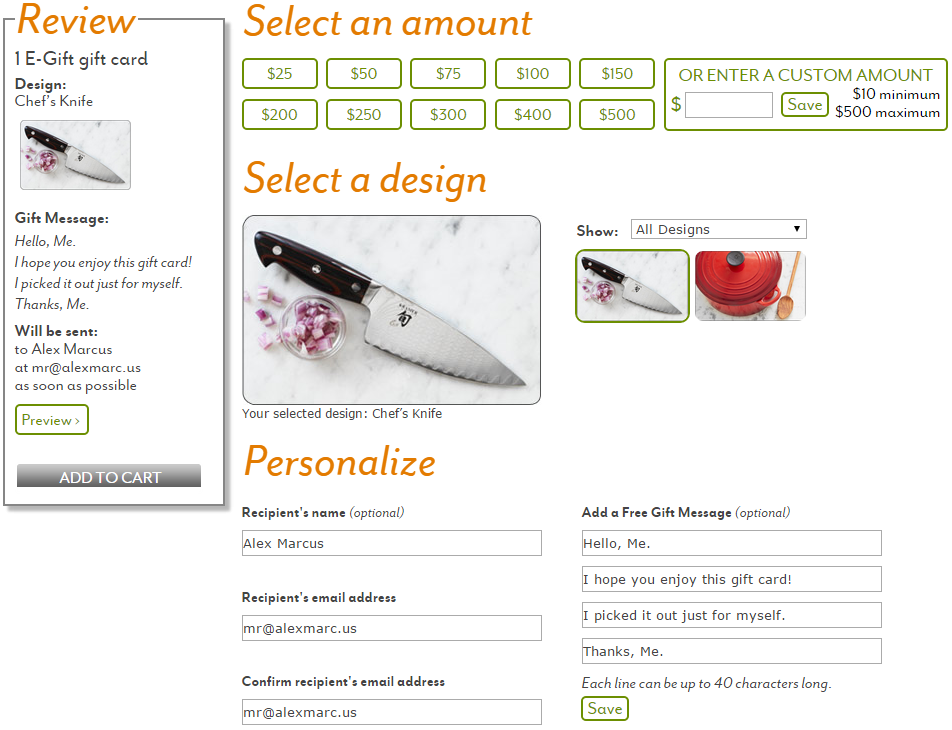
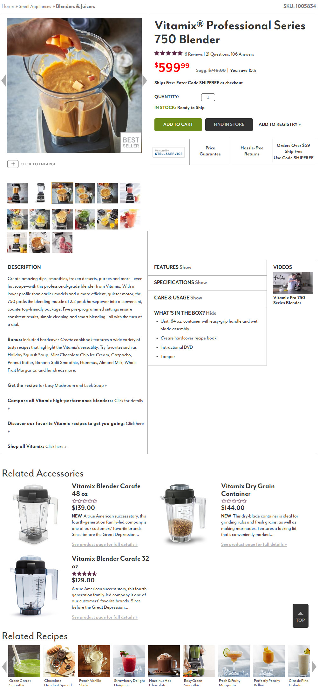
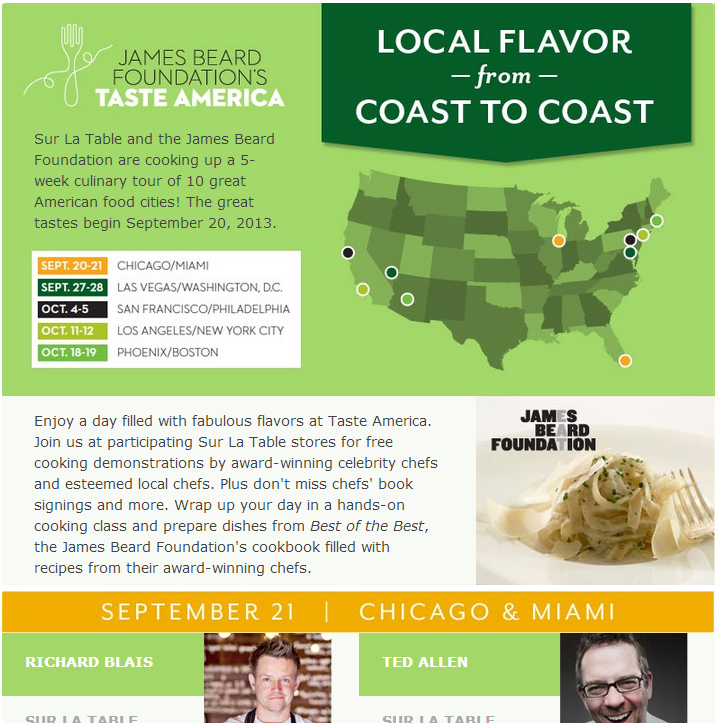
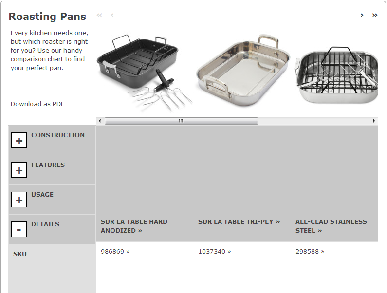
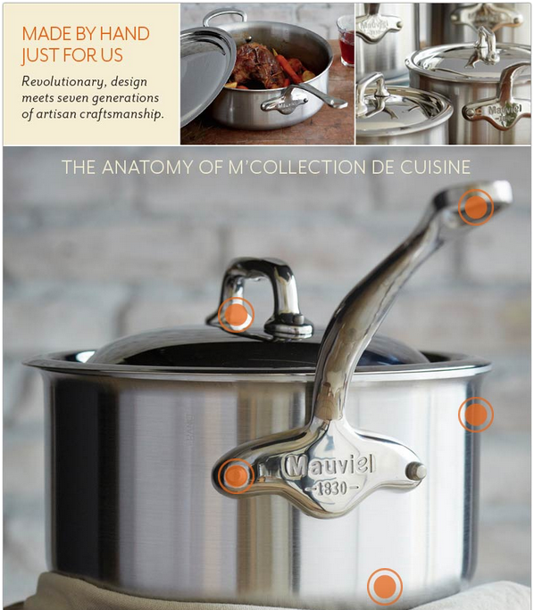

I worked for the headquarters of the high-end kitchen retailer [Sur La Table](https://www.surlatable.com/) as their lead front-end web developer. I was responsible for building user experiences on top of their enterprise eCommerce platform which would drive engagement and purchases.

Through day-to-day site maintenance and a number of large feature projects, I contributed major improvements to the SLT platform and learned a number of best-practice techniques.

## Site Navigation and Header
When the Sur La Table website needed a complete makeover of its top navigation and header, I was called in as the lead front-end developer on the project. I worked closely with design, QA, and management teams to deliver top-quality navigation UI backed by real-world user testing.

The top header and navigation sections run on HTML, CSS, JavaScript, and a single sprite file, with all the content integrated with an Oracle Business Control Center.

This was the biggest project of my web development career to date, in terms of prominence and views, and one of the most successful.

## Sur La Table Blog
In 2014, Sur La Table's blog had been largely abandoned for the better part of 3 years.  I was brought in to work alongside the design team to implement a fresh, new layout.

The WordPress blog was a custom developed theme based on Foodie.  The design team came up with a number of challenges, which I met head-on, including:

- Custom sidebar image menu
- Social media integration
- Custom category icons for posts
- Email list subscription
- Blog setup and administration

The result of my efforts, along with those of the design team, was a beautiful and functional blog experience to help drive Sur La Table's web presence and SEO.

## Custom Gift Cards
Gift cards are an important item for any eCommerce company, so Sur La Table enlisted my help to redesign their gift card purchase experience. Their previous design required navigation to several different pages for different types of gift cards, which was both inefficient and frustrating to the user.

In the new gift card page design, we focused on making the card selection as easy and intuitive as possible.  It allowed the user to choose from a variety of options including virtual vs traditional cards, amount, design, and personalization.  It also had a preview panel showing what the ordered card would look like on delivery.

The feedback for the new gift card page was tremendous.  Users praised it as a large improvement over the previous option and as one of the better gift card experiences on the web.

## Product Detail Page
Sur La Table's former product detail page served online shoppers for almost a decade, and was in desperate need of a makeover.  During my two years at SLT I had developed a strong understanding of their eCommerce needs and design strategies, and so I was made the lead internal developer for the redesign project.

Fitting with Sur La Table's new look and feel in 2015, a clean and interactive design was required.  Working alongside a team of designers and marketing strategists, I contributed a number of interface suggestions until a full UI was agreed upon.

I was given the full responsibility of coding the product detail page front-end.  Developing the product detail page of a major eCommerce site requires special attention paid to cross-browser compatibility, in addition to extensive QA and user acceptance testing.  Utilizing modern HTML standards, CSS techniques, and JavaScript libraries, I was able to construct a page that not only rendered reliably, but also presented an appealing and intuitive interface.

## Splash Layouts
Most major brands on the Sur La Table site are given their own landing and splash pages to tell their brand story. A readable and informative layout is imperative for these pages, so in cooperation with my design teammates I developed a number of such layouts.  These pages were fully interactive, involving lots of image mapping and grid styling.

## Product Comparison
I designed and developed several product comparison pages, using jQuery, HTML, and CSS. These pages had a number of interactive features to deliver an interactive, informative experience.  These features included guided side-scrolling for unlimited comparisons, section minimization, dual side-scrollbars for easier access, and a top-locking image row for easy identification.

## Product Anatomy
Sur La Table has a large selection of quality products with many features. In order to display product features in an interactive and user-friendly way, I was tasked with creating these anatomy pages to design team specifications. Each "hot spot" featured a roll-over popup with more details about the product.

